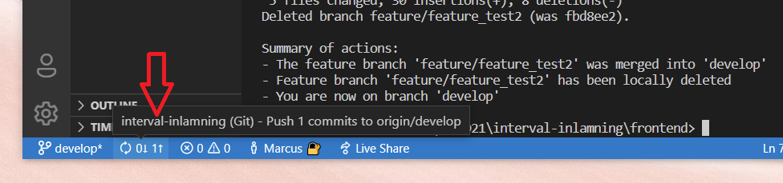

1. Skriv `git flow feature start feature_69` i teminalen för att starta utvecklingen av din feature.
2. En ny branch kommer att skapas med namnet `feature/feature_69`.
3. Nu kan du utveckla din feature!
4. När du är klar skriv först `git add --all` eller `git add .` 
5. därefter skriv `git commit -m "ditt meddelande" `
6. sedan skriv `git flow feature finish feature_69`.
7. pusha upp commit till origin/develop här 